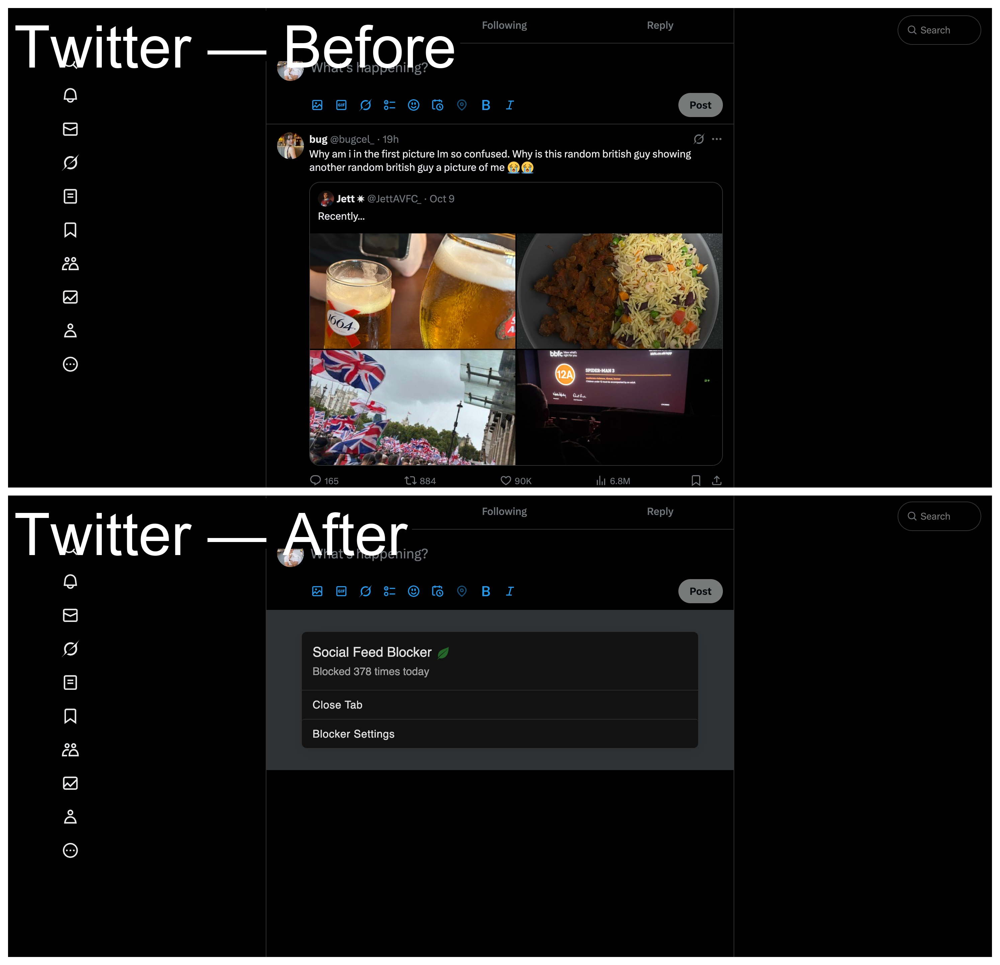
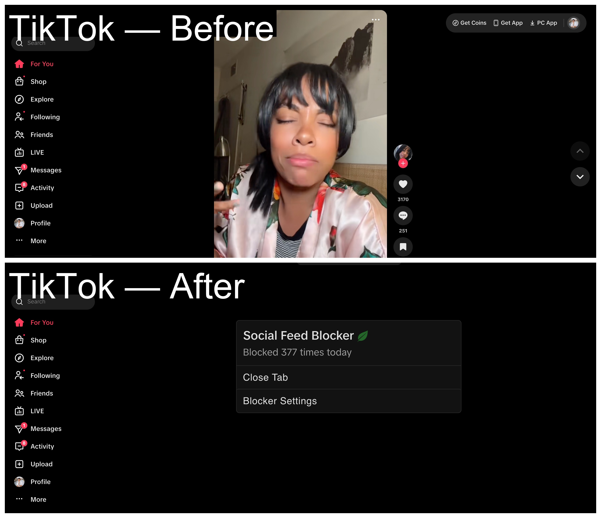

# Social Feed Blocker (Fork of News Feed Eradicator)

This is a focused fork of News Feed Eradicator that modernizes the build, simplifies the UI, and adds per‑site controls. It blocks distracting social feeds (Facebook, Twitter/X, Reddit, YouTube, Instagram, LinkedIn, TikTok, Threads, Substack, HN) and shows a clean, minimal panel you can use to open settings or temporarily allow a feed.





## What’s different in this fork

- Manifest V3 packaging for Chrome with programmatic content‑script registration via the `scripting` API.
- Robust registration (fixes “Duplicate script ID 'intercept'”): debounced register + unregister‑first + one‑shot retry.
- Simplified options page (React + MUI). Removed the old snabbdom options components entirely.
- Per‑site enable/disable with on‑demand permission requests; temporary disable options (5m/1h/1d/forever).
- More sites and fixes: Twitter/X, Instagram, YouTube Shorts, FB Reels, Reddit 2024 layout, Threads, TikTok, Substack, HN.
- Cleaner injected UI: a compact card with an inline green leaf mark; “Blocker Settings” and “Close Tab” actions.
- Icons reworked (trimmed padding, green brand variant); web‑accessible brand asset for content script usage.
- More reliable settings load on options page: immediate snapshot from storage with retries + React `useSyncExternalStore`.

## Screenshots

These are representative screenshots of the product. See `assets/` for full‑size images.


<!-- Before/after examples are showcased at the top -->

## Install (development)

This project targets WebExtensions (Chrome Manifest V3, and MV2/MV3 compatible code where possible).

Prereqs:

- Node.js 18+ recommended
- npm installed

Setup and run in watch mode:

```
npm install
make dev
```

Load the unpacked extension from the `build/` directory:

- Chrome: open `chrome://extensions`, enable Developer Mode, “Load unpacked…”, select `build/`.
- Firefox: use “about:debugging → This Firefox → Load Temporary Add‑on…”, select any file in `build/`.

Build a distributable zip:

```
make build
```

The packaged zip will be in `dist/` (MV3 manifest included as `build/manifest.json`).

## Contributing

We welcome contributions! A few notes to get you productive quickly:

- Code layout:
  - Content entry: `src/intercept.ts`
  - Injected UI (snabbdom): `src/components/index.ts` and `src/lib/inject-ui.ts`
  - Site adapters (feed detection + CSS): `src/sites/*`
  - Options page (React + MUI): `src/options/options.tsx`
  - Background service worker (MV3): `src/background/service-worker.ts` and `src/background/store/*`
- Adding a new site:
  1. Create `src/sites/<site>.ts` with `checkSite()` and `eradicate(store)`.
  2. Add paths, `origins`, and optional `css` to `src/sites/index.ts`.
  3. If you need site‑specific CSS, add `*.str.css` and import it in `src/sites/index.ts`.
  4. Verify permissions: the site’s origins must be listed in `src/manifest-chrome.json` under `optional_host_permissions`.
- Build/watch:
  - `make dev` (watch) and `make build` (release zip)
  - Rollup bundles: `intercept.js`, `options.js`, `service-worker.js`
- Formatting: run `npm run check` for typechecks; prettier config is included.

## Permissions & Privacy

- Remote code: not used. All code is bundled; no eval or remote JS execution.
- Host permissions: requested only for the sites you enable in the options page.
- Scripting: used to programmatically (un)register our packaged content script and stylesheet for enabled sites.
- Storage: settings are stored in `chrome.storage.sync`.

## Troubleshooting

- “Duplicate script ID 'intercept'” in console: fixed here by debouncing registration and unregistering before register; if you still observe it on Canary, reloading the extension clears stale registrations.
- Options doesn’t list sites on first load: the options page now eagerly snapshots settings from storage and re‑renders; ensure background permissions are granted for the sites you expect to see enabled.

## License

MIT (see `LICENSE`). Credit to the original [News Feed Eradicator](https://github.com/jordwest/news-feed-eradicator) project and community for the foundation this fork builds upon.
